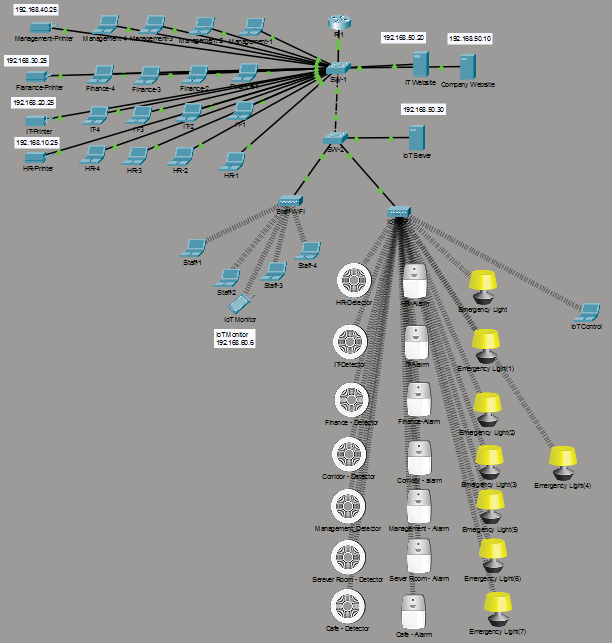
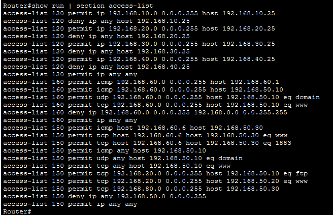
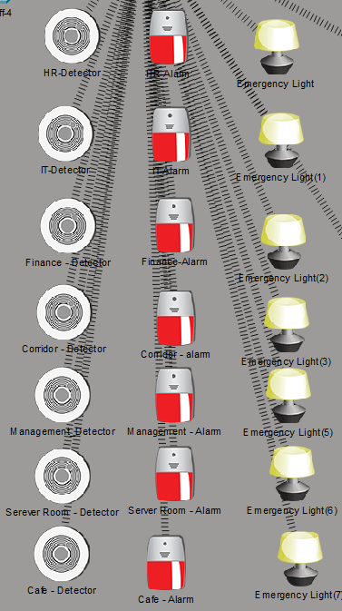

# Enterprise Smart Office Network Design  
## Secure Multi-VLAN Architecture with Service Control & IoT Integration  

---

## 1. Project Summary

This project simulates an enterprise-grade smart office network using Cisco Packet Tracer.  
The design focuses on network segmentation, controlled inter-VLAN routing, service restriction, and IoT isolation following real-world enterprise security practices.

The objective is to implement structured network architecture with enforced access control policies and monitored internal services.
## Network Topology

---

## 2. Network Design Architecture

### Core Components
- Cisco 2960 Layer 2 Switch  
- Router-on-a-Stick (802.1Q Trunking)  
- Access Point for Staff WiFi  
- Internal Servers (DNS, Web, IoT)  
- Departmental End Devices  
- IoT Devices (Smoke Detector + Siren + Emergency Lights)

### Logical Design
- Segmented VLAN-based topology  
- Centralized routing via subinterfaces  
- Policy enforcement at Layer 3 (Extended ACLs)  
- Service-based traffic filtering  

---

## 3. VLAN & IP Addressing Plan

| VLAN | Department | Subnet | Gateway |
|------|------------|--------|---------|
|  10  |    HR      | 192.168.10.0/24 | 192.168.10.1 |
|  20  |    IT      | 192.168.20.0/24 | 192.168.20.1 |
|  30  |   Finance  | 192.168.30.0/24 | 192.168.30.1 |
|  40  | Management | 192.168.40.0/24 | 192.168.40.1 |
|  50  |   Servers  | 192.168.50.0/24 | 192.168.50.1 |
|  60  | Staff WiFi | 192.168.60.0/24 | 192.168.60.1 |
|  80  |     IoT    | 192.168.80.0/24 | 192.168.80.1 |

- DHCP configured per VLAN with centralized DNS assignment.

---

## 4. Implemented Security Controls

### Inter-VLAN Control
- Extended ACLs applied on router subinterfaces  
- Department-level traffic filtering  
- Explicit permit/deny ordering  

### Server Protection Policy
- HTTP access to main server allowed  
- FTP access restricted to IT only  
- Administrative server access restricted  
- Direct server VLAN access controlled  

### Printer Access Policy
- Static printers (.25) in each VLAN  
- Access restricted to same VLAN only  

### Staff WiFi Restrictions

**Allowed:**
- ICMP to gateway  
- DNS (TCP/UDP 53) to DNS Server  
- HTTP to main web server  

**Denied:**
- Direct access to internal VLANs  
- Access to administrative services  

### IoT Network Isolation
- IoT VLAN restricted to IoT Server only  
- MQTT (Port 1883) allowed  
- HTTP access for monitoring  
- Full isolation from enterprise VLANs  
## Access Control List Configuration

---

## 5. IoT Fire Alarm System

### Infrastructure
- IoT Server (192.168.50.30)  
- Smoke Detector  
- Siren Alarm  
- Emergency Lights  

### Automation Rules
- If smoke level > 0.3 → Siren & Light ON  
- If smoke level < 0.15 → Siren & Light OFF  

### Security
- IoT traffic restricted via ACL  
- Only required service ports opened  
## IoT Fire Alarm – Active Scenario

---

## 6. Technical Concepts Demonstrated

- VLAN Segmentation & Broadcast Domain Isolation  
- 802.1Q Trunking  
- Router-on-a-Stick Inter-VLAN Routing  
- Extended Access Control Lists (Layer 3 Filtering)  
- DHCP per VLAN  
- Service-Based Traffic Control  
- Internal DNS & Web Hosting  
- IoT Integration within Enterprise Network  
- Structured IP Addressing Plan  

---

## 7. Key Learning Outcomes

- Designing secure segmented networks  
- Implementing layered security enforcement  
- Applying ACL logic correctly (top-down processing)  
- Isolating IoT systems from production networks  
- Structuring enterprise-grade addressing schemes  

---

## Author

Yazan Khaled  
ICT Student  
CCNA | CCNP  
Aspiring Enterprise Network Engineer
